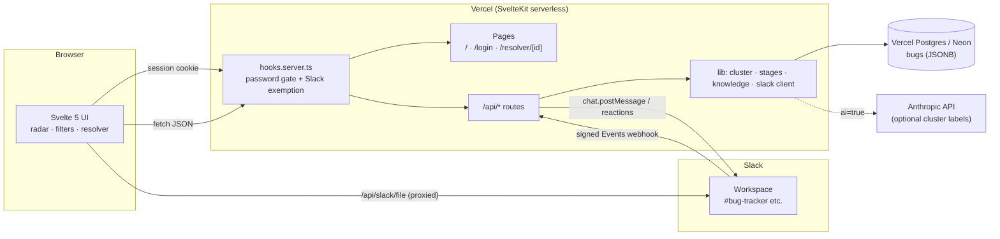
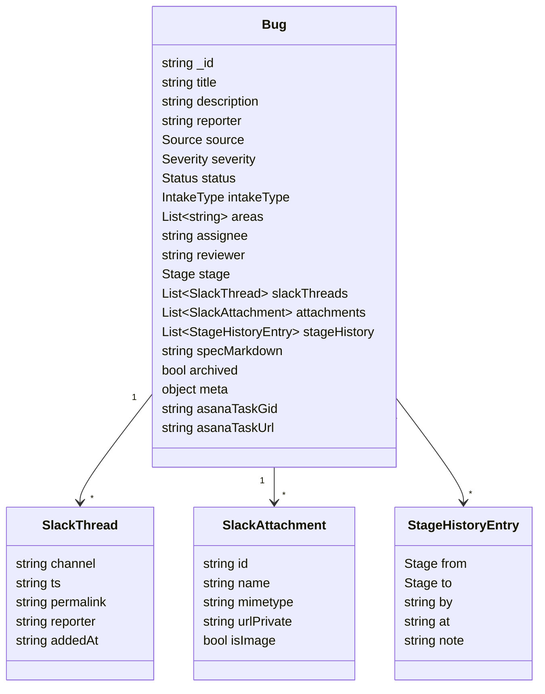
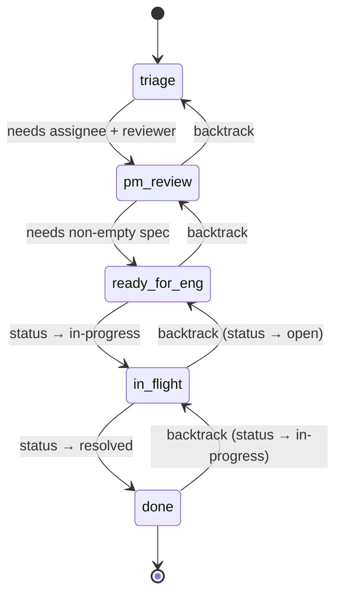
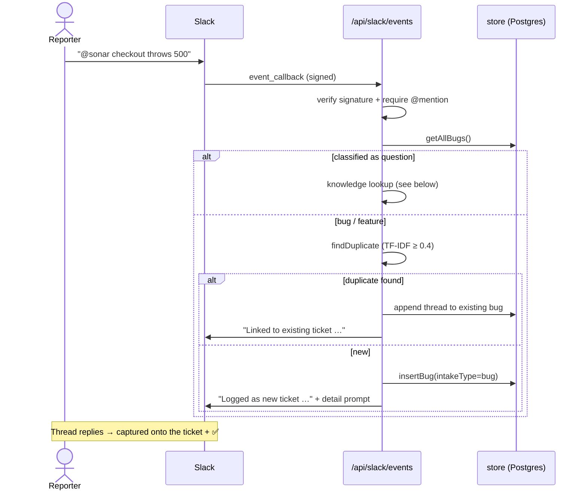
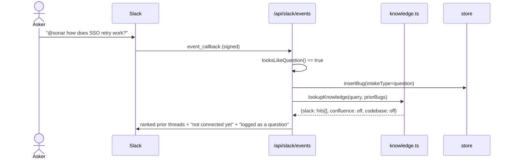
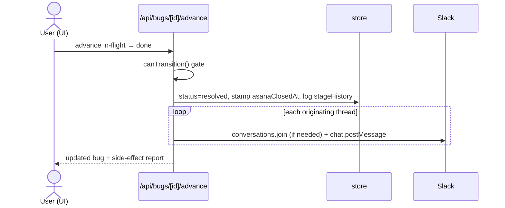

# Sonar

**Sonar is a bug & feedback radar.** It ingests reports (from a web form or
Slack), clusters related issues on a d3 radar, de-duplicates incoming reports,
answers questions from a knowledge lookup, and walks each ticket through a
resolver workflow — all behind a single shared-password gate.

It runs as a single SvelteKit app on Vercel, persists to Vercel Postgres
(Neon), and integrates live with Slack. Clustering is local TF-IDF by default,
with an optional Anthropic-powered mode.

- **Live:** https://sonar-five-eta.vercel.app (sign in with `SONAR_PASSWORD`, default `john`)
- **Repo:** https://github.com/johnrbell/sonar (push to `main` → Vercel auto-deploys)

---

## Table of contents

- [Tech stack](#tech-stack)
- [System architecture](#system-architecture)
- [Repository layout](#repository-layout)
- [Data model](#data-model)
- [Data store](#data-store)
- [Authentication](#authentication)
- [Subsystems](#subsystems)
  - [Radar & clustering](#radar--clustering)
  - [Dedupe](#dedupe)
  - [Ticket resolver workflow](#ticket-resolver-workflow)
  - [Slack integration](#slack-integration)
  - [Knowledge lookup (questions)](#knowledge-lookup-questions)
  - [Asana (placeholder)](#asana-placeholder)
- [Data flows](#data-flows)
- [HTTP API reference](#http-api-reference)
- [Frontend](#frontend)
- [Configuration](#configuration)
- [Local development](#local-development)
- [Deployment](#deployment)
- [Extending](#extending)

---

## Tech stack

| Layer | Choice |
| --- | --- |
| Framework | **SvelteKit 2** + **Svelte 5** (runes) |
| Language | **TypeScript** (strict), validated at boundaries with **zod** |
| Styling | **Tailwind CSS v4** (via `@tailwindcss/postcss`) |
| Visualization | **d3** (force-directed bubble radar) |
| Persistence | **Vercel Postgres** (Neon) via `@vercel/postgres`, one JSONB doc per bug |
| Hosting | **Vercel** via `@sveltejs/adapter-vercel` (serverless functions) |
| Optional AI | **Anthropic** (`claude-sonnet-4`) for cluster labeling — falls back to local |
| Package manager | **pnpm** (pinned via `packageManager`) |

There is **no ORM and no client-state library** — the store is thin SQL over a
JSONB column, and the UI is plain Svelte 5 runes with URL-synced filter state.

---

## System architecture



Everything is one deployment. Inbound Slack events hit a **public** route
(`/api/slack/events`) secured by HMAC signature verification instead of the
session cookie; every other API route is behind the password gate.

---

## Repository layout

```
src/
├── hooks.server.ts              # Auth gate; exempts /api/login + /api/slack/events
├── app.html, app.css, app.d.ts
├── lib/
│   ├── schemas.ts               # zod schemas + TS types (Bug, intake, dedupe, stages…)
│   ├── constants.ts             # FEATURE_AREAS, thresholds, area normalization
│   ├── mocks.ts                 # Postgres-backed store (getAllBugs, insertBug, …)
│   ├── seed-bugs.json           # ~40 synthetic seed bugs ("Nimbus" SaaS)
│   ├── cluster-text.ts          # Pure TF-IDF: tokenize, vectorizeQuery, clusterLocal
│   ├── cluster.ts               # clusterWithAI (Anthropic) → falls back to local
│   ├── cluster-views.ts         # Cluster→view-model shaping for the UI
│   ├── stages.ts                # Resolver state machine (canTransition, …)
│   ├── asana-stamp.ts           # Synthetic Asana gid/URL stamping
│   ├── bug-actions.ts           # Client helpers for mutating bugs
│   ├── filter-helpers.ts        # Filter predicates + substring search
│   ├── url-sync.ts              # Filter state ⇄ query string
│   └── server/
│       ├── auth.ts              # Password check + session token
│       ├── slack.ts             # Slack Web API client + signature verification
│       ├── knowledge.ts         # 3-source knowledge lookup for questions
│       └── db/seed.ts           # `pnpm db:seed` entrypoint
└── routes/
    ├── +layout.svelte/.ts       # Shell
    ├── +page.svelte             # Main radar + panel + filters
    ├── login/+page.svelte
    ├── resolver/[id]/+page.*    # Per-ticket resolver workflow
    ├── components/              # BubbleViz, ClusterPanel, filters, modal, …
    └── api/
        ├── login, logout
        ├── bugs (GET list, POST create)
        ├── bugs/[id] (GET, PATCH, DELETE)
        ├── bugs/[id]/advance    # Stage transition + side effects
        ├── bugs/[id]/sources    # Append a Slack thread to a bug
        ├── cluster              # Cluster all bugs (local or ?ai=true)
        ├── dedupe               # Similarity search
        ├── asana                # Placeholder task creation
        └── slack/
            ├── events           # PUBLIC signed Events webhook
            └── file             # Gated proxy for private Slack files
```

---

## Data model

Everything is a **`Bug`** document (validated by `BugSchema` in
[`src/lib/schemas.ts`](src/lib/schemas.ts)) — "bug" is the base type; features
and questions are the same shape with a different `intakeType`.



Enums: `source` = internal | public | platform-modal | api | slack ·
`severity` = low | medium | high · `status` = open | in-progress | resolved ·
`intakeType` = bug | feature | question · `stage` = triage | pm-review |
ready-for-eng | in-flight | done.

Notable `meta` keys:
- **bug** → `device`, `browser`, `url`, `repro`, `expectedActual`
- **feature** → `userPain`, `proposedApproach`, `urgency`
- **question** → `audience`, `context`
- **`slackReplies[]`** → `{ ts, reporter, text, at }` captured from thread replies

`areas` are drawn from a fixed catalog of 20 **feature areas** (Login/SSO,
Dashboard, Search, …) in [`constants.ts`](src/lib/constants.ts), which is what
clustering and filtering key off of.

---

## Data store

[`src/lib/mocks.ts`](src/lib/mocks.ts) is a thin async store over a single
table:

```sql
CREATE TABLE bugs (
  id         TEXT PRIMARY KEY,   -- Bug._id
  doc        JSONB NOT NULL,     -- the full Bug document
  created_at TIMESTAMPTZ NOT NULL DEFAULT now()
);
```

- **Lazy migrate + seed:** every query first awaits `ensureReady()`, which does
  `CREATE TABLE IF NOT EXISTS` and, if the table is empty, loads
  [`seed-bugs.json`](src/lib/seed-bugs.json) (`ON CONFLICT DO NOTHING`, so
  concurrent cold starts can't duplicate).
- **Why Postgres (not in-memory):** Slack events land in a *different*
  serverless instance than the one serving the UI; a shared DB is required for
  a Slack-filed bug to appear in the radar.
- **Writes** (`insertBug`, `updateMockBug`) rewrite the whole JSONB doc;
  `updateMockBug` shallow-merges the patch, so nested objects like `meta` must
  be merged by the caller.
- **Reset:** `pnpm db:seed -- --force` truncates and re-seeds.

Connection string is read from `POSTGRES_URL` / `DATABASE_URL` /
`POSTGRES_PRISMA_URL` / `POSTGRES_URL_NON_POOLING` (Neon exposes several).

---

## Authentication

A deliberately lightweight **shared-password gate**
([`hooks.server.ts`](src/hooks.server.ts) + [`server/auth.ts`](src/lib/server/auth.ts)):

- `POST /api/login` checks the password (`SONAR_PASSWORD`, default `john`) and
  sets an HttpOnly cookie whose value is `SONAR_SESSION_SECRET` (rotate it to
  invalidate all sessions).
- The `handle` hook gates `/`, `/resolver/*`, and all `/api/*` **except**
  `/api/login` and `/api/slack/events` (the latter is secured by Slack signature
  verification instead, since Slack calls it without a cookie).
- Protected APIs return `401`; protected pages `303`-redirect to `/login`.

> This keeps casual visitors out — it is not designed to resist a determined
> attacker.

---

## Subsystems

### Radar & clustering

The home page renders a d3 force-directed bubble radar where each bubble is a
cluster of related bugs.

- **Local (default):** [`cluster-text.ts`](src/lib/cluster-text.ts) builds
  TF-IDF vectors over each bug's `title + description`, computes pairwise cosine
  similarity (with a `+0.18` boost per shared feature area), and unions bugs
  above `DEFAULT_CLUSTER_THRESHOLD` (0.3) into clusters via union-find. Labels
  are derived from the dominant area + top keyword.
- **AI (optional):** with `ANTHROPIC_API_KEY` set, `GET /api/cluster?ai=true`
  asks Claude to group the bugs; **any failure silently falls back** to the
  local clusterer.
- The pure functions in `cluster-text.ts` are also imported client-side for
  in-browser drill-down re-clustering.

### Dedupe

`POST /api/dedupe` ranks a query (`text`, or `title`/`description`) against the
non-archived corpus using the same TF-IDF cosine, returning matches at or above
`DEFAULT_DEDUPE_THRESHOLD` (0.4), optionally scoped to one `intakeType`. It's a
recall-vs-precision knob: a miss just files a new bug; a false positive buries a
real one, so the threshold is tighter than clustering.

### Ticket resolver workflow

Bugs and feature requests walk a 5-stage state machine
([`stages.ts`](src/lib/stages.ts)); **questions never enter it**. The rules are
a single pure module imported by both the API (to gate) and the UI (to disable
buttons) so they can't disagree.



- Transitions move **one step** at a time (forward gated by preconditions;
  backward unconditional but audit-logged in `stageHistory`).
- **Side effects** (in `POST /api/bugs/[id]/advance`, idempotent):
  - `pm-review → ready-for-eng`: stamps a **placeholder Asana task**.
  - `in-flight → done`: marks Asana closed **and posts a Slack resolution
    follow-up** to every originating thread (auto-joining the channel if needed).

### Slack integration

A live bot ([`server/slack.ts`](src/lib/server/slack.ts) +
[`routes/api/slack/*`](src/routes/api/slack/events/+server.ts)).

- **Inbound:** `POST /api/slack/events` verifies the HMAC signature
  (`SLACK_SIGNING_SECRET`), then acts **only when Sonar is @-mentioned**:
  - a **question** → [knowledge lookup](#knowledge-lookup-questions) + filed as
    a question ticket;
  - otherwise → dedupe, then append to the matched bug or file a new one
    (capturing file attachments), and reply with a **prompt for more detail**.
  - **Thread replies** on a tracked thread are captured (no mention needed) and
    appended to the ticket, confirmed with a ✅ reaction.
- **Outbound:** `chat.postMessage` acks/prompts/resolutions, `reactions.add`,
  `conversations.join`, `chat.getPermalink`, `users.info`.
- **File proxy:** `GET /api/slack/file` (gated) streams private Slack files with
  the bot token so screenshots render in the UI.

> **Implementation note:** all Slack Web API calls are **form-encoded**, not
> JSON. Slack's read methods (`users.info`, `chat.getPermalink`) silently ignore
> a JSON body — sending JSON there causes reporters to fall back to raw user IDs
> and permalinks to go missing.

**Required Slack config:** bot scopes `app_mentions:read`, `chat:write`,
`channels:history`, `channels:read`, `channels:join`, `files:read`,
`users:read` (+ `reactions:write` for the ✅, `groups:*` for private channels);
Event Subscriptions request URL `…/api/slack/events` subscribed to
`message.channels` (needed for reply capture) and/or `app_mention`.

### Knowledge lookup (questions)

[`server/knowledge.ts`](src/lib/server/knowledge.ts) answers questions from
**three sources** behind one shared `SourceResult` shape:

1. **Previous Slack conversations — implemented.** TF-IDF cosine over the
   content of Slack-sourced tickets (original message + captured replies live in
   `description`), top matches above a recall-oriented 0.12 threshold, each with
   a thread permalink, snippet, and % match.
2. **Confluence docs — stubbed.** Lights up when `CONFLUENCE_BASE_URL` +
   `CONFLUENCE_TOKEN` are set and the search call is implemented.
3. **Codebase (ike) — stubbed.** Lights up when `IKE_API_URL` is set and wired.

`lookupKnowledge()` fans out to all three; the Slack handler renders them
uniformly and labels unconnected sources "_not connected yet_".

### Asana (placeholder)

No real Asana integration. "Create task" CTAs and the `pm-review → ready-for-eng`
transition stamp a synthetic gid/URL (`asana-stamp.ts`) onto the bug so the
workflow is exercisable end-to-end.

---

## Data flows

### Slack bug intake (with dedupe + prompt)



### Slack question → knowledge lookup



### Resolve → Slack follow-up



---

## HTTP API reference

| Method & path | Auth | Purpose |
| --- | --- | --- |
| `POST /api/login` | public | Set session cookie |
| `POST /api/logout` | gated | Clear session |
| `GET /api/bugs` | gated | List all bugs |
| `POST /api/bugs` | gated | Create a bug (validated intake) |
| `GET /api/bugs/[id]` | gated | Fetch one |
| `PATCH /api/bugs/[id]` | gated | Partial update (severity, status, reviewer, spec, archive, meta…) |
| `DELETE /api/bugs/[id]` | gated | Delete |
| `POST /api/bugs/[id]/advance` | gated | Stage transition + side effects |
| `POST /api/bugs/[id]/sources` | gated | Append a Slack thread to a bug |
| `GET /api/cluster` | gated | Cluster all bugs (`?ai=true` for Anthropic) |
| `POST /api/dedupe` | gated | Similarity search |
| `POST /api/asana` | gated | Stamp placeholder task (bug or cluster) |
| `POST /api/slack/events` | **public (signed)** | Slack Events webhook |
| `GET /api/slack/file` | gated | Proxy a private Slack file |

---

## Frontend

Svelte 5 (runes) with URL-synced filter state (`url-sync.ts`) so views are
shareable/back-button friendly.

| Component | Role |
| --- | --- |
| `+page.svelte` | Radar + cluster panel + filters shell; state orchestration |
| `BubbleViz.svelte` | d3 force-directed radar of clusters |
| `ClusterOverview.svelte` / `ClusterPanel.svelte` | Selected-cluster detail; bug cards, Slack chips, attachments, meta fields, per-type chips |
| `InlineFiltersBar.svelte` / `FiltersMenu.svelte` / `InlineMultiPicker.svelte` | Severity/status/type/area/source/reporter filters + search |
| `LogBugModal.svelte` | Manual intake form (bug/feature/question, per-type fields) |
| `ArchivePool.svelte` | Drag-to-archive overlay |
| `DrillBreadcrumb.svelte` | Drill-down navigation within a cluster |
| `resolver/[id]/+page.svelte` | Stage timeline, spec editor, advance/backtrack, audit log |

`ClusterPanel` renders `intakeType`-specific chips (cyan "Question"), per-type
meta fields, and hides the resolver stage for questions.

---

## Configuration

See [`.env.example`](.env.example).

| Variable | Default | Purpose |
| --- | --- | --- |
| `SONAR_PASSWORD` | `john` | Shared sign-in password |
| `SONAR_SESSION_SECRET` | `sonar-session-v1` | Session-cookie value (rotate to sign everyone out) |
| `POSTGRES_URL` / `DATABASE_URL` | _(required)_ | Postgres connection (auto-set on Vercel; `vercel env pull` locally) |
| `ANTHROPIC_API_KEY` | _(unset)_ | Enables optional AI clustering |
| `SLACK_BOT_TOKEN` | _(unset)_ | Bot User OAuth Token (`xoxb-…`) |
| `SLACK_SIGNING_SECRET` | _(unset)_ | Verifies inbound Slack Events requests |
| `CONFLUENCE_BASE_URL` + `CONFLUENCE_TOKEN` | _(unset)_ | Reserved — knowledge source #2 |
| `IKE_API_URL` | _(unset)_ | Reserved — knowledge source #3 (codebase) |

> Slack vars are stored as **Sensitive** in Vercel, so `vercel env pull` returns
> them blank — that's expected, not an empty value.

---

## Local development

```bash
pnpm install
vercel env pull .env.development.local   # get POSTGRES_URL (+ optional keys)
pnpm dev                                  # http://localhost:5173  (password: john)
```

Other scripts:

```bash
pnpm build                # svelte-kit sync && vite build
pnpm check                # svelte-check type check
pnpm db:seed -- --force   # truncate + re-seed the bugs table
```

---

## Deployment

Hosted on **Vercel** with the **GitHub integration**: push to `main` on
[`johnrbell/sonar`](https://github.com/johnrbell/sonar) and Vercel builds &
deploys to production automatically (aliased to `sonar-five-eta.vercel.app`).

```bash
git push origin main      # → triggers a production deploy
```

Direct CLI deploys (`vercel deploy`) also work; `vercel redeploy <url>` reuses a
prior build's output (useful to pick up env-var changes without rebuilding).
The Neon Postgres database is connected to the project as a resource, injecting
the `POSTGRES_URL`/`DATABASE_URL` env vars across environments.

---

## Extending

- **Wire up Confluence / codebase knowledge:** implement the two stub searchers
  in [`server/knowledge.ts`](src/lib/server/knowledge.ts) (they already return a
  `SourceResult`; the Slack reply renders them automatically once `connected`).
- **Real Asana:** replace `asana-stamp.ts` + the stamping in the advance
  endpoint with live task creation/close calls.
- **Smarter classification/dedupe:** the intake classifier (`looksLikeQuestion`)
  and dedupe are TF-IDF/heuristic; swap in embeddings or an LLM behind the same
  function signatures.

For deeper internal notes, see [`src/lib/README.md`](src/lib/README.md).
